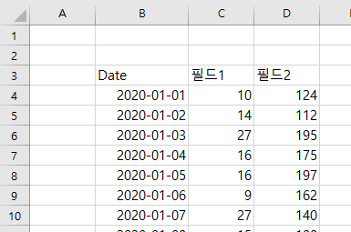

# PHP Spreadsheet

## 0. 사전 준비

### 0.1 Composer 설치

- [Composer 다운로드 및 설치](http://getcomposer.org/download )
  - **Install Shell Menus** 선택

### 0.2 php.ini 수정

- `세미콜론(;)` 제거

  ```
  extension=fileinfo
  extension=gd2
  extension=mbstring
  extension=openssl
  ```

## 1. 시작하기

### 1.1 설치

```bash
$ composer require phpoffice/phpspreadsheet
```

### 1.2 사용

```php
require_once '설치 경로/vendor/autoload.php';	// 위의 설치 경로 불러오기
```

## 2. Parsing



- 예제 Excel 파일은 위와 같음

### 2.1 File Load

- 파일명 뿐 아니라 파일 디렉토리 또한 포함 가능

```php
$excelFilePath = 'test.xlsx';
$oSpreadsheet = \PhpOffice\PhpSpreadsheet\IOFactory::load($excelFilePath);
```

### 2.2 Sheet Count

```php
$sheetsCount = $oSpreadsheet->getSheetCount();
```

### 2.3 Sheet 정보

```php
for($sheet = 0; $sheet < $sheetsCount; $sheet++){
	$oSpreadsheet->setActiveSheetIndex($sheet);
	$oSheet = $oSpreadsheet->getActiveSheet();
	$sheetName = $oSheet->getTitle();
	$sheetState = $oSheet->getSheetState();
    
    echo $sheet . "\t" . $sheetName . "\t" . $sheetState . PHP_EOL;
}
```

- **setActivateSheetIndex(`$Sheetnumber`)** - Sheet 활성화

  ```php
  $oSpredsheet->setActivateSheetIndex($sheetnumber);
  ```

- **getActiveSheet()** - 활성화된 Sheet 가져오기

  ```php
  $oSheet = $oSpreadsheet->getActiveSheet();
  ```

- **getTitle()** - Sheet명

  ```php
  $sheetName = $oSheet->getTitle();
  ```

- **getSheetState()** - Sheet 상태

  ```php
  $sheetState = $oSheet->getSheetState();
  ```

### 2.4 마지막 행과 열 구하기

```php
$highestRow     = $oSheet->getHighestRow(); // 마지막 행
$highestColumn  = $oSheet->getHighestColumn(); // 마지막 컬럼

echo "highestRow : " . $highestRow ."\t highestColumn : ". $highestColumn. PHP_EOL;
// highestRow : 34	highestColumn : D
```

- **getHighestRow()** - 마지막 행

  ```php
  $highestRow = $oSheet->getHighestRow();
  ```

- **getHighestColumn()** - 마지막 열

  ```php
  $highestColumn = $oSheet->getHighestColumn();
  ```

### 2.5 표 데이터 Header 구하기

- Excel의 열은 숫자가 아닌 영문자이므로 변환을 해주어야 함

  - 사전 준비 함수

    ```php
    function makeColumns() {
        $aColumns = array();
        for($i = 0; $i < 26; $i++){
            $aColumns[] = chr(65 + $i);
        }
    
        return $aColumns;
    }
    ```

  - 준비

    ```php
    $aColumns = makeColumns();
    /* 
    	array(0 => "A", 1 => "B", 2 => "C", ... , 25 => "Z")
    */
    $hColumns = array_flip($aColumns);
    /*
    	array('A' => 0, 'B' => 1, 'C' => 2, ... , 'Z' => 25)
    */
    ```

- Header 읽어오기

  ```php
  $aDataHeader = array();
  
  $maxIndex = $hColumns[$highestColumn];
  $curRow = 3;	// 예제 Excel 파일 표 데이터의 header가 존재하는 행
  
  for($i = 1; $i <= $maxIndex; $i++){	// Excel Data는 1부터 시작(0이 아님 주의)
      $strCellPos = $aColumns[$i].$curRow;	// B3, C3, D3
      $val = $oSheet->getCell($strCellPos)->getValue();	// 해당 Cell의 값
      $aDataHeader[] = $val;
  }
  
  var_dump($aDataHeader);
  ```

  ```
  array(3) {
    [0] =>
    string(4) "Date"
    [1] =>
    string(7) "필드1"
    [2] =>
    string(7) "필드2"
  }
  ```

### 2.6 표 데이터 Value 구하기

- Excel에 입력된 날짜를 SQL의 Date 타입과 맞춰주기 위해서 변환하는 함수 준비

  ```php
  function fromExcelToLinux($excel_time){
      return ($excel_time - 25569) * 86400;
  }
  ```

- Value 읽어오기

  ```php
  $aDataValues = array();	// Value의 행을 담을 전체 배열 생성
  $curRow++;	// 위에서 $curRow는 Header로 쓰였고, 그 이후는 Value 이므로 증가시킨 이후 사용
  
  while ($curRow <= $highestRow) {
      $aData = array();	// 각 행의 Value를 담기 위한 임시 배열 생성
      
      // 위의 Header를 구하는 로직과 같음
      for($i = 1; $i <= $maxIndex; $i++) {
          $strCellPos = $aColumns[$i].$curRow;
          $val = $oSheet->getCell($strCellPos)->getValue();
          
          if($i == 1) {	// 첫번째 열 날짜 처리 필요
              $val = fromExcelToLinux($val);
              $val = date('Y-m-d', $val);
          }
          $aData[] = $val;
      }
      $aDataValues[] = $aData;
      $curRow++;
  }
  
  var_dump($aDataValues);
  ```

  ```
  ...
  [16] =>
    array(3) {
      [0] =>
      string(10) "2020-01-17"
      [1] =>
      string(20) "=RANDBETWEEN(0, 100)"	
      [2] =>
      string(20) "=RANDBETWEEN(0, 100)"
    }
  }
  ```
  
  - 엑셀의 함수 값을 숫자 값으로 바꾸려면 해당 범위나 값을`F2` 누르고 `F9`를 누르면 원하는 값으로 변환이 된다.

### 2.7 SQL Data화 하기

- 먼저 일치 시켜줄 Column명 배열 선언

  ```php
  $aDictionary = array(
  	'Date' => 'ad_date',
      '필드1' => 'f1',
      '필드2' => 'f2'
  );
  ```

- 함수 생성

  ```php
  function printSQLData($aDataHeader, $aDataValues){
      global $aDictionary;	// 메인에서 선언한 $aDictionary 배열 호출
      
      $aHeader = array();
      foreach($aDataHeader as $h)
          $aHeader[] = $aDictionary[$h];
      
      $strField = implode(',', $aHeader);	// 배열을 하나의 문자열로 변환
      
      $strValues = array();
      foreach($aDataValues as $row) {
          $strValue = "'" . implode("', '", $row) . "'";
          $arrValues[] = "(" . $strValue . ")";
      }
      
      var_dump($strField ."\t" . implode(',', $arrValues) . PHP_EOL);
  }
  ```

  ```
  string(875) "ad_date,f1,f2	('2020-01-01', '10', '124'),('2020-01-02', '14', '112'),('2020-01-03', '27', '195'),('2020-01-04', '16', '175')," ...
  ```

## 3. Refactoring

- 메인 코드

  ```php
  ini_set('memory_limit', '-1');	// 메모리 제한 해제
  
  require_once __DIR__ . '/vender/autoload.php';	// Java의 import와 비슷
  
  $excelFileName = 'test01.xlsx';
  $oSpreadsheet = \PhpOffice\PhpSpreadsheet\IOFactory::load($excelFileName);
  
  $sheetsCount = $oSpreadsheet->getSheetCount();
  
  $aColumns = makeColumns();
  $hColumns = array_flip($aColumns);
  
  for($sheet = 0; $sheet < $sheetsCount; $sheet++) {
      $oSpreadsheet->setActiveSheetIndex($sheet);
      $oSheet = $oSpreadsheet->getActiveSheet();
  
      parse($oSheet);
  }
  ```

- parse 함수

  ```php
  function parse($oSheet) {
      global $aColumns, $hColumns;	// 메인에서 쓰는 변수 호출
      
      $highestRow = $oSheet->getHighestRow();
      $highestColumn = $oSheet->getHighestColumn();
      
      $maxIndex = $hColumns[$highestColumn];
      
      $aDataHeader = array();
      $curRow = 3;
      
      for($i = 1; $i <= $maxIndex; $i++) {
      	$strCellPos = $aColumns[$i].$curRow;
      	$val = $oSheet->getCell($strCellPos)->getValue();
      	$aDataHeader[] = $val;
  	}
      
      $aDataValues = array();
      $curRow++;
      while($curRow <= $highestRow) {
          $aData = array();
          for($i=1;$i<=$maxIndex;$i++) {
              $strCellPos = $aColumns[$i].$curRow;
              $val = $oSheet->getCell($strCellPos)->getValue();
              
              if ($i==1) {
                  $val = fromExcelToLinux($val);
                  $val = date('Y-m-d', $val);
              }
              $aData[] = $val;
          }
          $aDataValues[] = $aData;
          $curRow++;
      }
      
      printSQLDdata($aDataHeader, $aDataValues);
  }
  ```


## 4. 클래스화 & DB 입력

### 4.1 실행 부분

```php
<?php

ini_set('memory_limit', '-1');

require_once __DIR__ . '/../vendor/autoload.php';
include __DIR__ . '/ExcelParserPrototype.php';
include __DIR__ . '/DBMapper.php';
include __DIR__ . '/util.php';

$aColumns = makeColumns();
$hColumns = array_flip($aColumns);

$aDictionary = array(
    'Date' => 'ad_date',
    '필드1' => 'f1',
    '필드2' => 'f2'
);

$excelFileName = 'test01.xlsx';

$curRow = 3;

$oParser = new ExcelParserPrototype($excelFileName, new DBMapper());
$oParser->parse();

?>
```

### 4.2 Util

```php
<?php
    
function makeColumns() {
    $aColumns = array();
    for ($i = 0; $i < 26; $i++)
        $aColumns[] = chr(65 + $i);

    return $aColumns;
}

function fromExcelToLinux($excel_time){
    return ($excel_time - 25569) * 86400;
}

?>
```

### 4.3 Excel Parsing Class

#### 4.3.1 클래스 선언

```php
class ExcelParserPrototype {
    var $oSpreadsheet;	// Excel 파일을 받는 변수 선언
    var $excelFileName;	// Excel 파일명을 받는 변수 선언
    var $oMapper;		// DB 연결 클래스 변수 선언
}
```

#### 4.3.2 생성자

```php
function __construct($excelFileName, $oMapper) {
    $this->excelFileName = $excelFileName;
    $this->oMapper = $oMapper;
}
```

#### 4.3.3 함수

##### 4.3.3.1 메인 함수 - Parse()

```php
function parse() {
    $this->oSpreadsheet = \PhpOffice\PhpSpreadsheet\IOFactory::load($this->excelFileName);
   	$sheetsCount = $this->oSpreadsheet->getSheetCount();

   	for ($sheet = 0; $sheet < $sheetsCount; $sheet++) {
    	$this->oSpreadsheet->setActiveSheetIndex($sheet);
     	$oSheet = $this->oSpreadsheet->getActiveSheet();
     	$sheetName = $oSheet->getTitle();
     	$sheetState = $oSheet->getSheetState();

	    $this->parseSummary($oSheet);
   	}
}
```

##### 4.3.3.2 시트 배열화 - parseSummary(`$oSheet`)

```php
    function parseSummary($oSheet) {
        global $aColumns, $hColumns, $curRow;

        $aDataHeader = array();
        $highestRow = $oSheet->getHighestRow();
        $highestColumn = $oSheet->getHighestColumn();

        $maxIndex = $hColumns[$highestColumn];

        $aDataHeader = $this->getColumns($oSheet, $maxIndex);

        $aDataValues = array();
        $curRow++;

        while ($curRow <= $highestRow) {
            $aData = array();
            for ($i = 1; $i <= $maxIndex; $i++) {
                $strCellPos = $aColumns[$i] . $curRow;
                $val = $oSheet->getCell($strCellPos)->getValue();
                if ($i == 1) {
                    $val = fromExcelToLinux($val);
                    $val = date('Y-m-d', $val);
                }
                $aData[] = $val;
            }
            $aDataValues[] = $aData;
            $curRow++;
        }
        $this->InsertSummary($aDataHeader, $aDataValues);
    }
```

##### 4.3.3.3 getColumns(`$oSheet`, `$maxIndex`)

```php
function getColumns($oSheet, $maxIndex) {
    global $curRow, $aColumns;

    $aDataHeader = array();
    for ($i = 1; $i <= $maxIndex; $i++) {
        $strCellPos = $aColumns[$i] . $curRow;
        $val = $oSheet->getCell($strCellPos)->getValue();
        $aDataHeader[] = $val;
    }
    return $aDataHeader;
}
```

##### 4.3.3.4 배열화된 데이터 DB에 넘기기 - insertSummary(`$aDataHeader`, `$aDataValues`)

```php
function insertSummary($aDataHeader, $aDataValues) {
	global $aDictionary;

    $aRows = array();
    $aCols = array();
        
    foreach ($aDataHeader as $col)
        $aCols[] = $aDictionary[$col];

    $strHeaders = '(' . implode(', ', $aCols) . ')';
        
    foreach ($aDataValues as $row)
        $aRows[] = '(\'' . implode('\', \'', $row) . '\')';

    $this->oMapper->insertSummary($strHeaders, $aRows);
}
```

### 4.4 DB Connect Class

```php
<?php

class DBMapper
{  
    public $db;
    
    public function __construct() {
        $dsn = "mysql:host=127.0.0.1;port=3306;dbname=test;charset=utf8";
        try {
            $db = new PDO($dsn, "root", "root");
            $db->setAttribute(PDO::ATTR_EMULATE_PREPARES, false);
            $db->setAttribute(PDO::ATTR_ERRMODE, PDO::ERRMODE_EXCEPTION);
        } catch(PDOException $e) {
            echo $e->getMessage();
        }
        $this->db = $db;
    }

    public function insertSummary($strHeaders, $aRows) {
        $query = " INSERT INTO test_tbl " . $strHeaders . " VALUES " . implode(', ', $aRows);
        $this->db->query($query);
    }
}

?>
```


